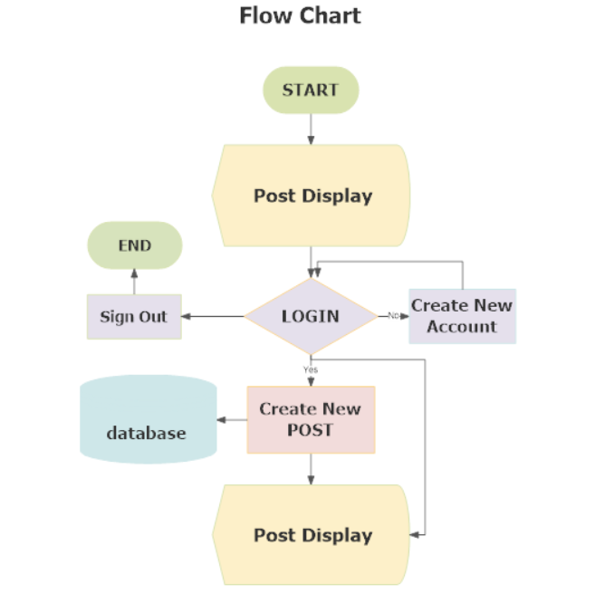
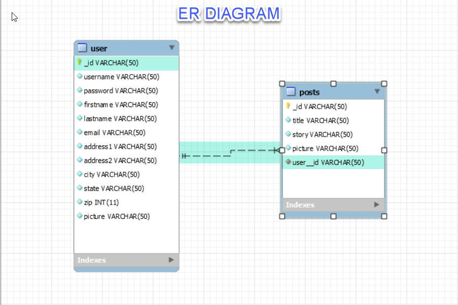

# Promote-The-Vote :us:
<!--  -->

## Overview
For someone feeling disenfranchised from our system, like their vote doesn’t matter, they can go to this site to communicate with other people in a similar state of mind, and also share their story. At the site, verifiably registered voters will be able to find resources that will help them vote. Those that are not registered will be provided with resources that will either allow them to register online if applicable, or give them appropriate forms and direct them where to go to register. This app will be moderated to provide as judgment free as possible environment for social interaction around our democracy.

### Heroku link
Checkout our deployed application [here](https://promotethevote.herokuapp.com/)!

## Power Point Presentation
Checkout our presentation [here](https://docs.google.com/presentation/d/1hR5nWxjQN1v0NqdIlmH3jy5J0-brWAPdG-6tPyvF5wA/edit#slide=id.p)!

## npm Dependencies
    axios
    bcryptjs
    cheerio
    config
    express
    express-validator
    jquery
    jsonwebtoken
    mongoose
    mongos
    passport
    passport-local
    concurrently

## Database
    MongoDB
    Mongoose

## Installation Guide

### Fork or Clone Project
```sh
$ git clone https://github.com/michjmend/Promote-The-Vote.git
```

### Install Yarn
```sh
$ yarn install
```

### Run Project
```sh
$ yarn dev
```
# PROJECT WORK FLOW

## Requirements

## Why is this Application Valuable?
Almost 92 million eligible Americans did not vote in the 2016 presidential elections.1 In the 2014 midterm elections, an estimated 143 million eligible Americans failed to vote, marking the lowest voter participation in 72 years.2 For the nation’s democracy to function properly and for government to provide fair representation, all eligible Americans must have the opportunity to vote—and be encouraged to do so. Our collective self-rule is established and fostered through free, fair, accessible, and secure elections through which the voice of every eligible American is heard.

## Brain storming
  * Who is your target audience?
      People of Voting age, citizens.
  * What is the problem that the product will address?
      Buyers desire finding products from multiple locations that fit their search query, this app will provide one stop shopping.
  * What is the primary goal of the product?
      This application will provide a platform for actual, US citizens to communicate with others about why they vote and believe that voting is important

## Flowchart


## ER Diagram
Used Star Schema for Database design


## Overview of the Intended Application:
* To increase voter engagement at a local level, the app should at a minimum:
* For guests not joined or logged in, users should be allowed to view the last five videos from their district, region or maybe a best of chosen by the moderator
* Users may join or log in.
* Only registered voters can post content
* Content is moderated
* Links or information are provided to sites like rock the vote or similar
* Information should be provided to when the next election is held, and/or where the user can vote
* Also, resources should be offered such as getting a ride to the polls
* We can partner with local voter activism organizations where possible
* Stories shared can be either text or video


## Contributors
This project exists thanks to all the people who contributed.


## License
[Full Stack Developers @RUTGERS](LICENSE) © Andrew Tirpok/Kristen De La Rosa/Sushmita Yande/Michelle Mendieta
